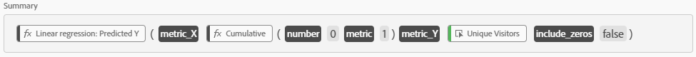

# Linear Regression Line
This metric gives you a simple Linear Regression Line to approximate your actual data for time series analysis. Think of the trend line in Excel. It can help to make trended data easier to understand. Created by [frederikwerner](https://github.com/frederikwerner) for [fullstackanalyst.io](https://www.fullstackanalyst.io/?r=g)

## Usage examples
* Use with Unique Visitors to see where the traffic trend is headed.

## Business questions
* What is the trend in my data for the selected date range?
* How does the current trend compare to the larger, overall trend?

## Screenshots


## Dependencies
* [Simple Incrementor](Simple%20Incrementor.md) metric for X Axis variable

## Used Functions
Linear Regression: Predicted Y

## Tags
Statistics, Regression, Trend, Time Series Analysis

## Definitions
### Screenshot of metric overview

### Screenshot of metric builder

### API definition of metric
```json
{
    "definition":{
        "formula":{
            "func":"ls-pred-linear",
            "description":"Linear regression: Predicted Y",
            "x":{
                "func":"cumul",
                "description":"Cumulative",
                "n":0,
                "col":1
            },
            "y":{
                "func":"metric",
                "name":"metrics/visitors",
                "description":"Unique Visitors"
            },
            "include-zeros":false
        },
        "func":"calc-metric",
        "version":[1,0,0]
    }
}
```