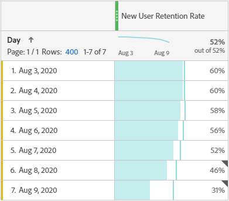
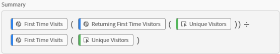
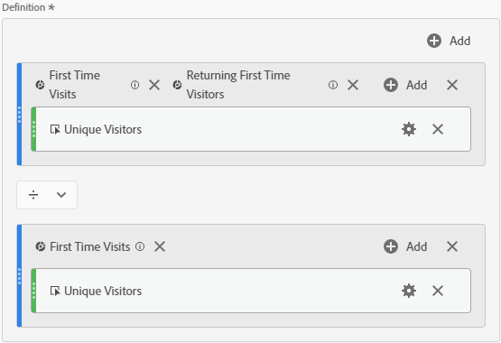

# New User Retention Rate
Metric showing the percentage of users who came to a site for the first time and came back in the Reporting Window. Created by [frederikwerner](https://github.com/frederikwerner) for [fullstackanalyst.io](https://www.fullstackanalyst.io/?r=g)

## Usage examples
* Put in a table or graph to see the trend in New User Retention over time
* Use with marketing campaigns to see how many of the newly acquired users came back

## Business questions
* Are the people we acquire through campaigns coming back to our site?
* Are the features we build beneficial or detrimental to user retention?

## Screenshots


## Dependencies
* [Returning First Time Visitors](../Segments/Returning%20First%20Time%20Visitors.md) Segment
* First Time Visits Segment

## Tags
Retention, Customer Journey, Acquisition

## Definitions
### Screenshot of metric overview

### Screenshot of metric builder

### API definition of metric
```yaml
{
    "definition": {
        "formula": {
            "func": "divide",
            "col1": {
                "func": "calc-metric",
                "formula": {
                    "func": "metric",
                    "name": "metrics/visitors",
                    "description": "Unique Visitors"
                },
                "version": [
                    1,
                    0,
                    0
                ],
                "filters": [
                    {
                        "func": "segment-ref",
                        "description": "Returning First Time Visitors",
                        "id": "[ID of Returning First Time Visitors Segment]"
                    },
                    {
                        "func": "segment-ref",
                        "description": "First Time Visits",
                        "id": "First_Time_Visits"
                    }
                ]
            },
            "col2": {
                "func": "calc-metric",
                "formula": {
                    "func": "metric",
                    "name": "metrics/visitors",
                    "description": "Unique Visitors"
                },
                "version": [
                    1,
                    0,
                    0
                ],
                "filters": [
                    {
                        "func": "segment-ref",
                        "description": "First Time Visits",
                        "id": "First_Time_Visits"
                    }
                ]
            }
        },
        "func": "calc-metric",
        "version": [
            1,
            0,
            0
        ]
    }
}
```