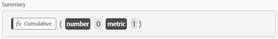

# Simple Incrementor
This metric was created to serve as the X variable on Time Series Analysis metrics. It just goes up by one for every row of data, regardless of there being some actual data or not. Created by [frederikwerner](https://github.com/frederikwerner) for [fullstackanalyst.io](https://www.fullstackanalyst.io/?r=g)

## Usage examples
* As X variable in Time Series Analysis or counter variable.

## Screenshots


## Used Functions
* Cumulative

## Tags
* Counters, Statistics, Time Series Analysis

## Definitions
### Screenshot of metric overview

### Screenshot of metric builder

### API defintion of metric
```json
{
    "definition":{
        "formula":{
            "func":"cumul",
            "description":"Cumulative",
            "n":0,
            "col":1
        },
        "func":"calc-metric",
        "version":[1,0,0]
    }
}
```