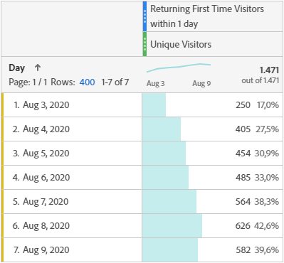
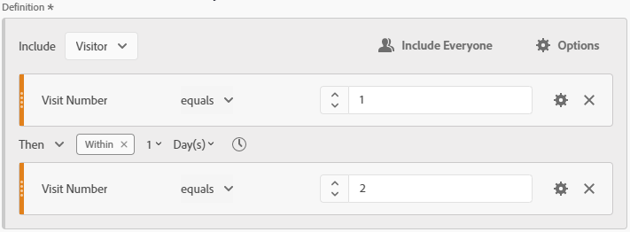

# Returning First Time Visitors
Segment to return all Hits from Visitors who had both their first and second Visit within a defined time window in a given Date Range. "Within 1 day" restriction can be changed to any interval as needed. Created by [frederikwerner](https://github.com/frederikwerner) for [fullstackanalyst.io](https://www.fullstackanalyst.io/?r=g)

## Usage examples
* Can be used in a table or graph together with the Unique Visitors metric to show the number of Visitors who had both their first and their second Visit within a given time in the selected Date Range.
* Can be used in Retention Metrics
* Can be used to show the percentage of Visitors who were acquired and retained within a given time in a given Date Range
* Can be used with the First Time Visits Segment to show the day a User came for the first time and returned within a certain time later on

## Business questions
* How many Users visited my site for the first time and came back within one week?
* How many of the new Users acquired by a campaign came back within one day?

## Screenshots


## Tags
Retention, Customer Journey, Acquisition

## Definitions
### Screenshot of segment builder

### API definition of segment
```yaml
{
    "definition": {
        "container": {
            "func": "container",
            "pred": {
                "func": "sequence",
                "stream": [
                    {
                        "func": "container",
                        "pred": {
                            "val": {
                                "func": "attr",
                                "name": "variables/visitnumber"
                            },
                            "func": "eq",
                            "num": 1,
                            "description": "Visit Number"
                        },
                        "context": "hits",
                        "description": "AUTO_GENERATED"
                    },
                    {
                        "container": "hits",
                        "unit": "day",
                        "func": "time-restriction",
                        "count": 1,
                        "limit": "within"
                    },
                    {
                        "func": "container",
                        "pred": {
                            "val": {
                                "func": "attr",
                                "name": "variables/visitnumber"
                            },
                            "func": "eq",
                            "num": 2,
                            "description": "Visit Number"
                        },
                        "context": "hits",
                        "description": "AUTO_GENERATED"
                    }
                ]
            },
            "context": "visitors"
        },
        "func": "segment",
        "version": [
            1,
            0,
            0
        ]
    }
}
```