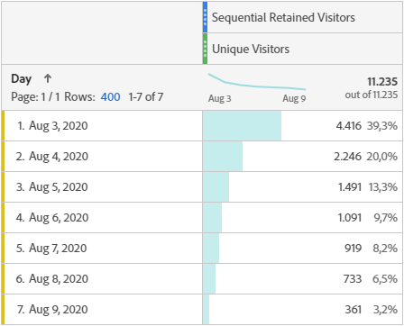
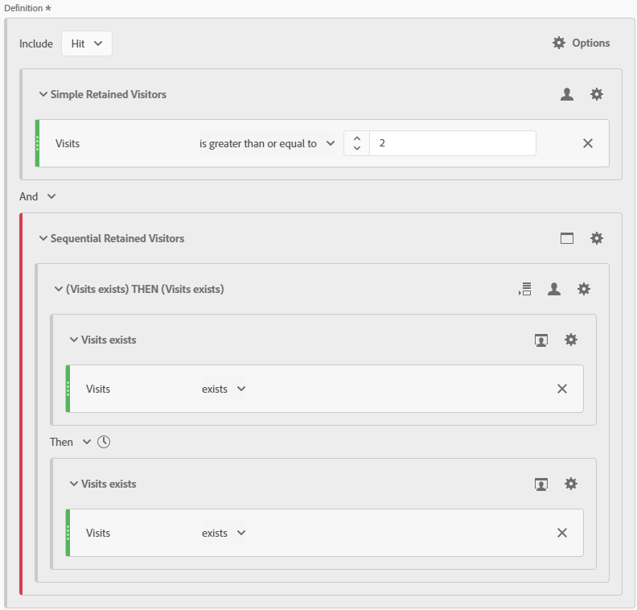

# Sequential Retained Visitors
Sequential Segment to return only Hits from the first Visit in a sequence of Visits from Visitors who had two or more Visits in a given Date Range. Created by [frederikwerner](https://github.com/frederikwerner) for [fullstackanalyst.io](https://www.fullstackanalyst.io/?r=g)

## Usage examples
* Can be used in a table or graph together with the Unique Visitors metric to show the number of Visitors who came for the first  time of a sequence of Visits in a given Date Range and came back later.
* Can be used in Retention Metrics
* Can be used to show the percentage of Visitors who were retained in a given Date Range but acquired on a given date.

## Business questions
* How many Users visited my site on a given date and came back later?

## Screenshots


## Tags
Retention, Customer Journey, Sequencing

## Definitions
### Screenshot of segment builder

### API definition of segment
```yaml
{
    "definition": {
        "container": {
            "func": "container",
            "pred": {
                "func": "and",
                "preds": [
                    {
                        "func": "container",
                        "pred": {
                            "val": {
                                "evt": {
                                    "func": "event",
                                    "name": "metrics/visits"
                                },
                                "func": "total"
                            },
                            "func": "ge",
                            "num": 2,
                            "description": "Visits"
                        },
                        "context": "visitors",
                        "description": "Simple Retained Visitors"
                    },
                    {
                        "func": "container",
                        "pred": {
                            "func": "without",
                            "pred": {
                                "func": "container",
                                "pred": {
                                    "func": "sequence-prefix",
                                    "stream": [
                                        {
                                            "func": "container",
                                            "pred": {
                                                "evt": {
                                                    "func": "event",
                                                    "name": "metrics/visits"
                                                },
                                                "func": "event-exists",
                                                "description": "Visits"
                                            },
                                            "context": "visits"
                                        },
                                        {
                                            "func": "container",
                                            "pred": {
                                                "evt": {
                                                    "func": "event",
                                                    "name": "metrics/visits"
                                                },
                                                "func": "event-exists",
                                                "description": "Visits"
                                            },
                                            "context": "visits"
                                        }
                                    ],
                                    "context": "visitors"
                                },
                                "context": "hits"
                            }
                        },
                        "context": "hits",
                        "description": "Sequential Retained Visitors"
                    }
                ]
            },
            "context": "hits"
        },
        "func": "segment",
        "version": [
            1,
            0,
            0
        ]
    }
}
```