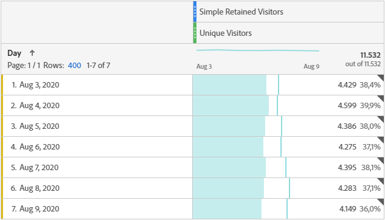
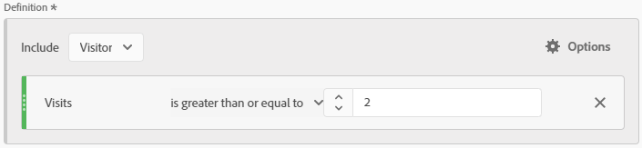

# Simple Retained Visitors
Segment to return all Hits from Visitors who had two or more Visits in a given Date Range. Created by [frederikwerner](https://github.com/frederikwerner) for [fullstackanalyst.io](https://www.fullstackanalyst.io/?r=g)

## Usage examples
* Can be used in a table or graph together with the Unique Visitors metric to show the number of Visitors who came back at least once in the selected Date Range.
* Can be used in Retention Metrics
* Can be used to show the percentage of Visitors who were retained in a given Date Range

## Business questions
* How many Users visited my site more than once?
* How many of the Users acquired by a campaign came back?

## Screenshots


## Tags
Retention, Customer Journey

## Definitions
### Screenshot of segment builder

### API definition of segment
```yaml
{
    "definition": {
        "container": {
            "func": "container",
            "pred": {
                "val": {
                    "evt": {
                        "func": "event",
                        "name": "metrics/visits"
                    },
                    "func": "total"
                },
                "func": "ge",
                "num": 2,
                "description": "Visits"
            },
            "context": "visitors"
        },
        "func": "segment",
        "version": [
            1,
            0,
            0
        ]
    }
}
```